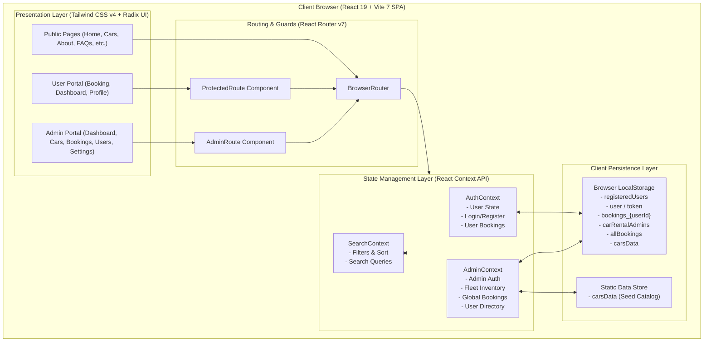
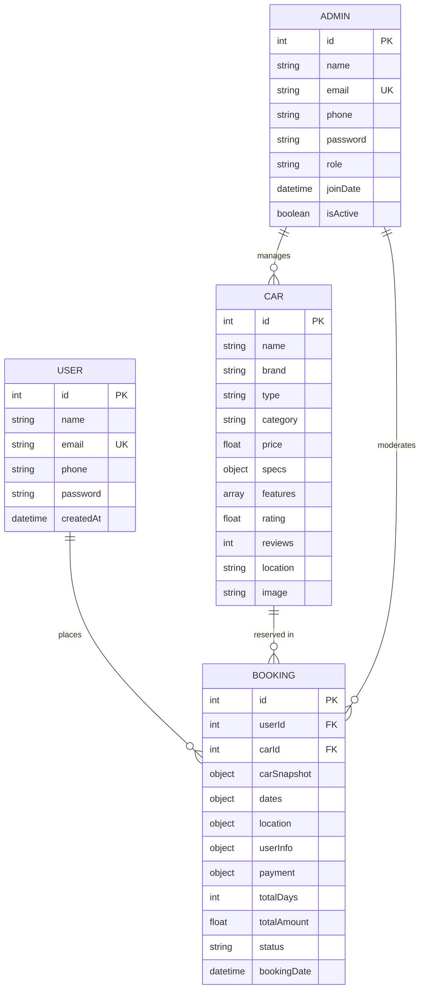
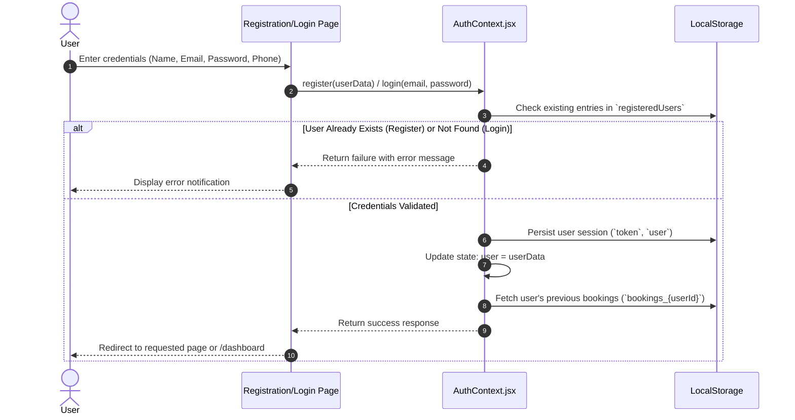
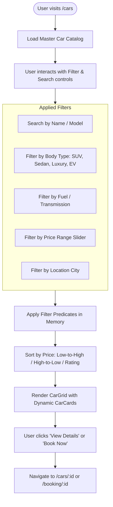
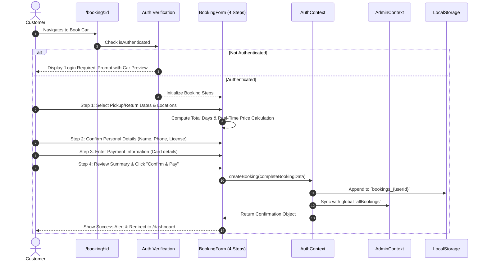
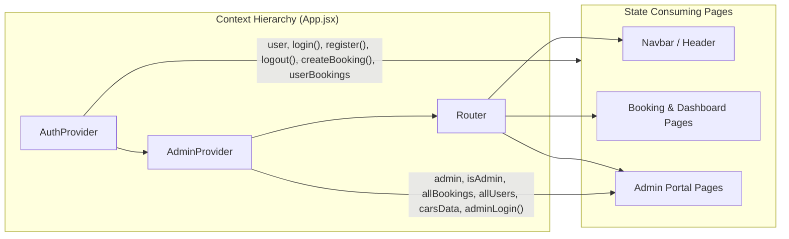

# 🚗 Car Rental Platform — System Design & Workflow Documentation

---

## 📌 1. Executive Overview

The **Car Rental Platform** is a modern, responsive web application designed to deliver an end-to-end car leasing and rental experience. It offers a dual-portal ecosystem:
1. **User / Customer Portal**: Enables customers to browse vehicle fleets, apply advanced search filters, view comprehensive vehicle specifications, execute a multi-step booking workflow, and monitor their rental history from a personal dashboard.
2. **Admin Management Portal**: Provides platform operators with real-time fleet management, booking state tracking, user administration, financial telemetry, and platform settings.

---

## 🏗️ 2. High-Level System Architecture

The current architecture is a **Client-Side Single-Page Application (SPA)** built with React 19 and Vite 7, powered by React Context for state management and an abstracted LocalStorage persistence layer ready for future REST/GraphQL backend transition.



---

## 🧩 3. Application Layers & Component Breakdown

| Layer | Technologies / Modules | Responsibilities |
| :--- | :--- | :--- |
| **Presentation Layer** | React 19, Tailwind CSS v4, Lucide React, Radix UI Primitives | Responsive UI rendering, interactive modals, date pickers, form validation, step navigation. |
| **Layout Layer** | `MainLayout.jsx`, `AdminLayout.jsx` | Encapsulates navigational sidebars, global headers/footers, responsive breadcrumbs, and user session menus. |
| **Routing & Protection** | React Router v7, `ProtectedRoute.jsx`, `AdminRoute.jsx` | Enforces URL routing, public vs private page transitions, and authentication/role guards. |
| **State Management** | `AuthContext`, `AdminContext`, `SearchContext` | Centralizes user auth session, admin privileges, booking creations, dynamic fleet state, and filter queries. |
| **Persistence / Data** | Browser `localStorage`, `src/data/cars.js` | Emulates database transactions, stores customer profiles, booking registries, and car catalogs. |

---

## 🗂️ 4. Project Directory Structure

```
Car-Rent-Frontend/
├── public/                 # Static assets, logos, favicon
├── src/
│   ├── assets/             # Brand graphics and images
│   ├── components/
│   │   ├── admin/          # Admin-specific components (AdminRoute, etc.)
│   │   ├── auth/           # Login/Register form cards & route guards
│   │   ├── booking/        # Multi-step booking form, DatePicker, Summary
│   │   ├── car/            # CarCard, CarFilters, CarGrid, CarDetailsSection
│   │   ├── common/         # Navbar, Footer, ScrollToTop, ErrorBoundary
│   │   └── ui/             # Radix & custom UI atoms (Button, Input, Card, Select, Slider)
│   ├── context/
│   │   ├── AdminContext.jsx# Admin auth, global bookings, fleet operations
│   │   ├── AuthContext.jsx # Customer auth, session state, user booking creation
│   │   └── SearchContext.jsx# Global car search and filter parameters
│   ├── data/
│   │   └── cars.js         # Master car dataset (seed catalog with specs & features)
│   ├── hooks/              # Custom reusable React hooks
│   ├── layouts/
│   │   ├── AdminLayout.jsx # Admin dashboard sidebar and top bar layout
│   │   └── MainLayout.jsx  # Customer-facing header, container, footer layout
│   ├── pages/
│   │   ├── admin/          # Admin pages (Dashboard, Cars, Bookings, Users, Settings)
│   │   ├── About.jsx       # Company info & mission
│   │   ├── Booking.jsx     # Dynamic booking page for a selected car ID
│   │   ├── CarDetails.jsx  # In-depth vehicle overview, specifications, pricing
│   │   ├── Cars.jsx        # Car search, grid, filtration and sorting
│   │   ├── Contact.jsx     # Customer inquiry page
│   │   ├── Dashboard.jsx   # Customer personal booking manager & status tracking
│   │   ├── FAQ.jsx         # Frequently asked questions
│   │   ├── Home.jsx        # Hero section, featured cars, testimonials
│   │   ├── HowItWorks.jsx  # Rental guide & platform instructions
│   │   ├── Login.jsx       # Customer authentication portal
│   │   ├── Profile.jsx     # Customer profile settings & personal data
│   │   ├── Register.jsx    # Customer account creation
│   │   └── Support.jsx     # Help center and customer care
│   ├── styles/             # Global CSS and Tailwind directives
│   ├── App.jsx             # Master route definitions and context provider nesting
│   └── main.jsx            # React root mount and entry point
├── package.json            # Node.js dependencies and script configs
└── vite.config.js          # Vite build and plugin configurations
```

---

## 📊 5. Data Models & Entity Relationships



### Key Entity Schemas

#### 1. Car Entity
```json
{
  "id": 1,
  "name": "Tesla Model 3",
  "type": "Electric",
  "category": "Sedan",
  "price": 4500,
  "specs": {
    "seats": 5,
    "transmission": "Automatic",
    "fuel": "Electric",
    "range": "491 km",
    "topSpeed": "225 km/h",
    "acceleration": "3.1s (0-100)"
  },
  "features": ["Autopilot", "Touchscreen", "Wireless Charging", "Glass Roof"],
  "rating": 4.9,
  "reviews": 128,
  "location": "Mumbai",
  "image": "https://images.unsplash.com/photo-..."
}
```

#### 2. Booking Entity
```json
{
  "id": 1724860000000,
  "userId": 1724850000000,
  "car": { "id": 1, "name": "Tesla Model 3", "price": 4500, "...": "..." },
  "dates": {
    "pickup": "2026-09-01T00:00:00.000Z",
    "return": "2026-09-05T00:00:00.000Z",
    "pickupFormatted": "September 1st, 2026",
    "returnFormatted": "September 5th, 2026"
  },
  "location": {
    "pickup": "Mumbai Airport Terminal 2",
    "return": "Mumbai Airport Terminal 2"
  },
  "userInfo": {
    "firstName": "John",
    "lastName": "Doe",
    "email": "john@example.com",
    "phone": "+91 9876543210"
  },
  "payment": {
    "dailyRate": 4500,
    "subtotal": 18000,
    "tax": 1800,
    "total": 19800,
    "cardLastFour": "4242"
  },
  "totalDays": 4,
  "totalAmount": 19800,
  "status": "confirmed",
  "bookingDate": "2026-08-28T22:50:00.000Z"
}
```

---

## 🔄 6. Detailed System Workflows

### 6.1. User Registration & Authentication Workflow



---

### 6.2. Car Discovery, Filtration & Search Workflow



---

### 6.3. Multi-Step Car Reservation & Checkout Workflow



---

### 6.4. Admin Portal & Management Operations Workflow

```mermaid
flowchart TD
    Admin([Admin User]) --> AdminAuth{Logged into Admin?}
    AdminAuth -- No --> AdminLogin[/admin/login & /admin/register]
    AdminLogin --> VerifyAdmin[Validate against carRentalAdmins]
    VerifyAdmin -- Success --> AdminLayout[/admin/* Dashboard]
    AdminAuth -- Yes --> AdminLayout

    subgraph AdminModules [Admin Control Modules]
        M1[Admin Dashboard\n- Revenue Metrics\n- Total Bookings\n- Fleet Count\n- Recent Activity]
        M2[Admin Cars\n- Add New Vehicle\n- Edit Specs & Pricing\n- Toggle Availability\n- Delete Vehicle]
        M3[Admin Bookings\n- View All Reservations\n- Filter by Status\n- Approve / Complete / Cancel]
        M4[Admin Users\n- View Customer List\n- View Total Bookings per User\n- Account Status]
        M5[Admin Settings\n- Platform Currency\n- Tax Rate Config\n- Company Profile]
    end

    AdminLayout --> M1
    AdminLayout --> M2
    AdminLayout --> M3
    AdminLayout --> M4
    AdminLayout --> M5
```

---

## 🛡️ 7. Route Security & Access Control Matrix

| Path | Layout | Access Level | Route Guard | Purpose |
| :--- | :--- | :--- | :--- | :--- |
| `/` | `MainLayout` | Public | None | Landing page & hero showcase |
| `/cars` | `MainLayout` | Public | None | Fleet search & filtration |
| `/cars/:id` | `MainLayout` | Public | None | Car technical specifications |
| `/about`, `/contact`, `/faq` | `MainLayout` | Public | None | Informational & support |
| `/login`, `/register` | Plain | Public (Guest) | Redirect if logged in | User authentication |
| `/booking/:id` | `MainLayout` | Protected | `useAuth().isAuthenticated` | 4-step car booking process |
| `/dashboard` | `MainLayout` | Protected | `useAuth().isAuthenticated` | User bookings & status |
| `/profile` | `MainLayout` | Protected | `useAuth().isAuthenticated` | Customer account details |
| `/admin/login`, `/admin/register` | Plain | Public | None | Admin authentication |
| `/admin/` | `AdminLayout` | Admin Only | `AdminRoute` | High-level analytics |
| `/admin/cars` | `AdminLayout` | Admin Only | `AdminRoute` | Inventory CRUD operations |
| `/admin/bookings` | `AdminLayout` | Admin Only | `AdminRoute` | Order lifecycle management |
| `/admin/users` | `AdminLayout` | Admin Only | `AdminRoute` | Customer management |
| `/admin/settings` | `AdminLayout` | Admin Only | `AdminRoute` | Platform config |

---

## ⚡ 8. State Management Architecture



---

## 🚀 9. Future Roadmap & Backend Integration Strategy

When transitioning from the current Client-Side/LocalStorage model to a production enterprise-grade full-stack architecture:

1. **Backend API**: Implement a Node.js (Express / NestJS) or Python (FastAPI / Django) REST/GraphQL service.
2. **Database Integration**:
   - **PostgreSQL / MySQL**: For relational integrity (Users, Bookings, Payments, Cars, Invoices).
   - **Redis**: For caching vehicle availability, rate-limiting, and session management.
3. **Authentication & Security**:
   - JWT tokens with HTTP-only secure cookie refresh cycle.
   - Role-Based Access Control (RBAC) middleware for `ROLE_USER` and `ROLE_ADMIN`.
   - Password hashing with `bcrypt` / `argon2`.
4. **Payment Processing**:
   - Integration with Stripe / Razorpay Webhooks to confirm booking states securely upon payment capture.
5. **Media Storage**:
   - Cloudinary or AWS S3 for uploading high-resolution car images and user driver licenses.
6. **Real-time Notifications**:
   - WebSockets / Socket.io for instant booking status updates between customer and admin panels.

---
*Documentation generated for Car Rental System Architecture.*
